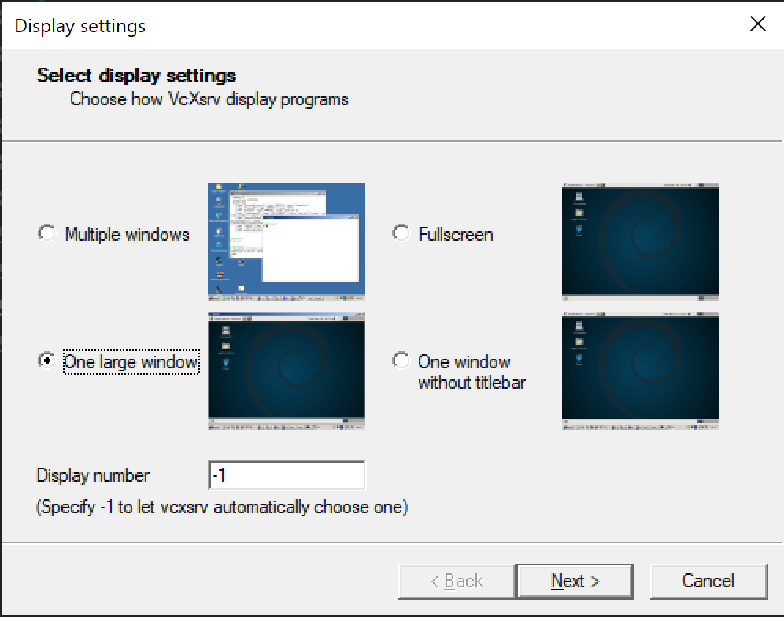
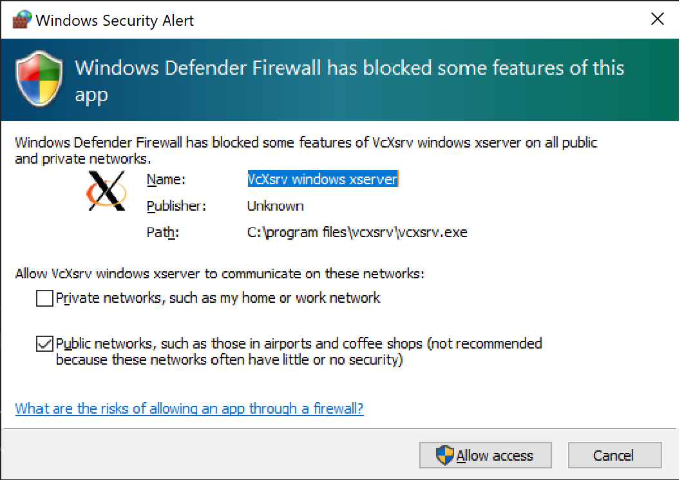
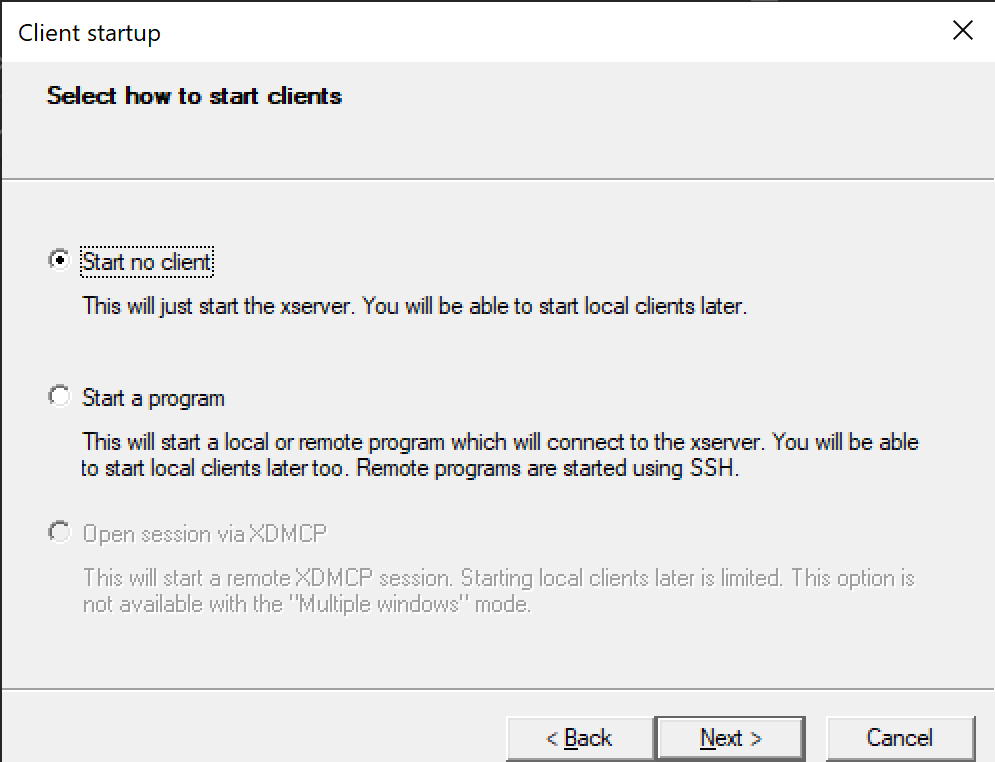
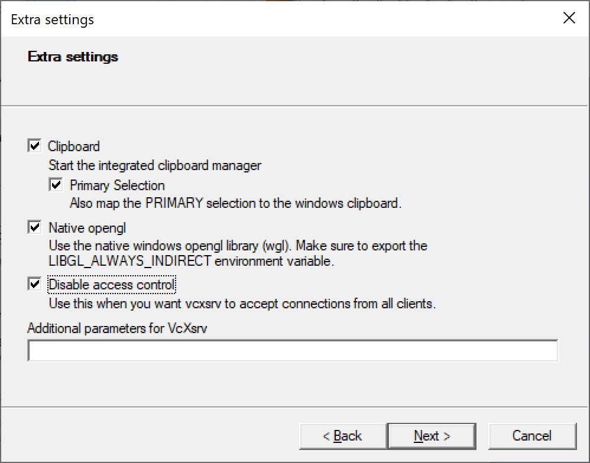
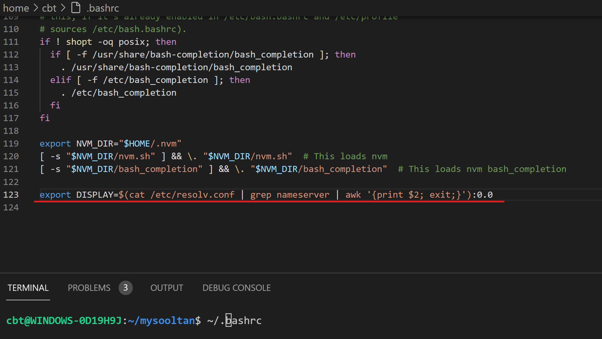
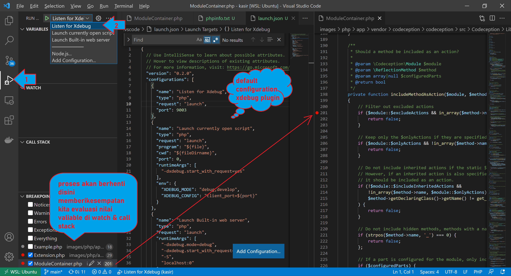

# Instal Composer dan Dependensi

Berikut ini perintah untuk menginstall composer dan dependensi aplikasi di ubuntu-20.04 (inc. WSL-2).
ini hanya butuh dijalankan sekali dan solusi sementara sampai nanti dapet dari devops versi finalnya.

## Lakukan ini untuk install composer
```sh
sudo apt update -y
sudo apt-get install git unzip php7.4-cli php7.4-curl php7.4-mbstring php7.4-xml php7.4-memcached php7.4-mysql
php -r "copy('https://getcomposer.org/installer', 'composer-setup.php');"
# update this key at https://composer.github.io/pubkeys.html
COMPOSER=756890a4488ce9024fc62c56153228907f1545c228516cbf63f885e036d37e9a59d27d63f46af1d4d07ee0f76181c7d3
php -r "if (hash_file('SHA384', 'composer-setup.php') === '$COMPOSER') { echo 'Installer verified'; } else { echo 'Installer corrupt'; unlink('composer-setup.php'); } echo PHP_EOL;"
sudo php composer-setup.php --install-dir=/usr/local/bin --filename=composer
php -r "unlink('composer-setup.php');"
```
## Masuk ke direktori applikasi dan install dependesi dari applikasi
```sh
cd image/php/app
composer install
```
Jika berhasil akan ada folder `vendor` di `images/php/app/ `
untuk mencoba codeption berhasil terinstal coba
```sh
./vendor/bin/codecept build
./vendor/bin/codecept dry-run acceptance
./vendor/bin/codecept dry-run functional
 ./vendor/bin/codecept dry-run unit
```

## Install nodejs dkk di wsl-2

Supaya mudah mengatur versi nodejs yang terinstall kita akan gunakan Nodejs Version Manager (nvm)
```sh
# update sesuai https://github.com/nvm-sh/nvm#install--update-script
curl -o- https://raw.githubusercontent.com/nvm-sh/nvm/v0.38.0/install.sh | bash
# tutup terminal (exit) dan kemudian buka kembali, cek nvm 
nvm -v
# kalau berhasil akan muncul seperti ini
# 0.38.0
```
Setelah selesai install nvm mari kita install nodejs menggunakan nvm
```sh
# cek node yang sudah terinstall
nvm ls
# melihat yang tersedia untuk diinstall 
nvm ls-remote
# melihat yang tersedia untuk diinstall, hanya versi lts (long time support)
nvm ls-remote --lts
# kita akan gunakan yang  lts paling akhir, install lts
nvm install --lts
# Installing latest LTS version.
# ...
# Now using node v14.17.3 (npm v6.14.13)
# Creating default alias: default -> lts/* (-> v14.17.3)
# Coba jalankan dan cek versi nodejs
node -v
# v14.17.3
# check nodejs package manager (npm)
npm -v
# 6.14.13
```

## Install Cromium Driver untuk testing codecept
Web Driver bisa menjadi pengganti PHPBrowser untuk melakukan test yang lebih realistis (menggunakan browser sesungguhnya)
[detail lihat disini](https://codeception.com/docs/modules/WebDriver.html)
Caranya untuk install pda ubuntu-20.04 + WSL-2 adalah berikut.
```sh
# Install library pendukung
sudo apt-get update
sudo apt-get install -y curl unzip xvfb libxi6 libgconf-2-4 wget
# Install chrome browser
wget https://dl.google.com/linux/direct/google-chrome-stable_current_amd64.deb
sudo apt install ./google-chrome-stable_current_amd64.deb
# cek installasi
google-chrome --version
# Google Chrome 91.0.4472.164 
# cek versi terakhir chrome driver di https://chromedriver.chromium.org/ dan download 
wget https://chromedriver.storage.googleapis.com/91.0.4472.101/chromedriver_linux64.zip
unzip chromedriver_linux64.zip
sudo mv chromedriver /usr/bin/chromedriver
sudo chown root:root /usr/bin/chromedriver
sudo chmod +x /usr/bin/chromedriver
# cek installasi
chromedriver --version
# ChromeDriver 91.0.4472.101 (af52a90bf87030dd1523486a1cd3ae25c5d76c9b-refs/branch-heads/4472@{#1462})
# Jika di wsl2 pastikan yang digunakan adalah /usr/bin/chromedriver cek sbb
which chromedriver 
# harus menampilkan /usr/bin/chromedriver
```
setelah itu untuk bisa menampilkan UI di windows dari linux chrome, pada windows install https://sourceforge.net/projects/vcxsrv/
jalankan xLauch `"C:\Program Files\VcXsrv\xlaunch.exe"` di windows, dan berikan akses firewall.





Kemudian di ubuntu buka file `~/.bashrc`, dan masukan konfigurasi berikut dibagian akhir file
```sh
export DISPLAY=$(cat /etc/resolv.conf | grep nameserver | awk '{print $2; exit;}'):0.0
```

pastikan tutup dulu terminal, kemudian buka lagi, jalankan perintah berikut untuk cek.
```sh
echo $DISPLAY
# seharusnya menampilkan info seperti "172.25.224.1:0.0"
```
Setelah itu jalankan chrome di WSL2(ubuntu) dgn perintah
```sh
google-chrome
```

chrome akan terbuka di windows.

##

## Install xDebug wsl2
```sh
php -v
# PHP 7.4.3 (cli) (built: Jul  5 2021 15:13:35) ( NTS )
# Copyright (c) The PHP Group
# Zend Engine v3.4.0, Copyright (c) Zend Technologies
#    with Zend OPcache v7.4.3, Copyright (c), by Zend Technologies
sudo apt install php-pear php7.4-dev
sudo pecl channel-update pecl.php.net
sudo pecl install xdebug
# Build process completed successfully
# Installing '/usr/lib/php/20190902/xdebug.so'
# install ok: channel://pecl.php.net/xdebug-3.0.4
# configuration option "php_ini" is not set to php.ini location
# You should add "zend_extension=/usr/lib/php/20190902/xdebug.so" to php.ini
# 
# perintah dibawaha adalah cara memasukan konfigurasi ke file /etc/php/7.4/cli/conf.d/20-xdebug.ini
echo 'zend_extension=xdebug.so' | sudo tee -a /etc/php/7.4/cli/conf.d/20-xdebug.ini > /dev/null
echo 'xdebug.mode = debug' | sudo tee -a /etc/php/7.4/cli/conf.d/20-xdebug.ini > /dev/null
echo 'xdebug.start_with_request = yes' | sudo tee -a /etc/php/7.4/cli/conf.d/20-xdebug.ini > /dev/null
php -v
# PHP 7.4.3 (cli) (built: Jul  5 2021 15:13:35) ( NTS )
# Copyright (c) The PHP Group
# Zend Engine v3.4.0, Copyright (c) Zend Technologies
#     with Zend OPcache v7.4.3, Copyright (c), by Zend Technologies
#     with Xdebug v3.0.4, Copyright (c) 2002-2021, by Derick Rethans
```
Setelah selesai setup diatas kita bisa menjalankan aplikasi php dlm mode debug sbb.
pertama jalankan x-debug client (listerner). di VS code seperti berikut



Setelah itu aplikasi bisa dijalankan dgn format 
```sh
php -dxdebug.mode=debug -dxdebug.client_host=127.0.0.1 -dxdebug.client_port=9003 -dxdebug.start_with_request=yes path/ke/code/php
```
contoh untuk codecept jalankan sbb
```sh
php -dxdebug.mode=debug -dxdebug.client_host=127.0.0.1 -dxdebug.client_port=9003 -dxdebug.start_with_request=yes vendor/bin/codecept run acceptance
```